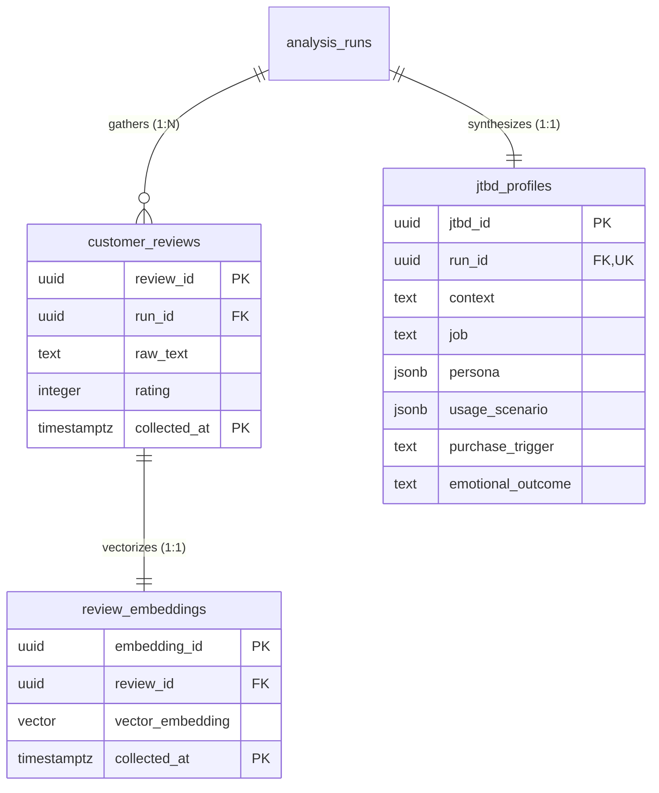

# REVIEW.md (Sprint 2-3 Review Domain DDL Review)

본 문서는 **Sprint 2-3 (Review Domain DDL)** 완료 후, **ChatGPT (Project Manager)**의 효율적인 코드 리뷰와 승인을 지원하기 위해 자동으로 생성된 스프린트 리뷰 표준 요약서입니다.

---

## 1. Sprint 정보
* **Sprint 번호**: Sprint 2-3
* **대상 Domain**: Review Domain (고객 리뷰, 텍스트 임베딩, JTBD 프로필)
* **Commit Message**: `feat(review): Sprint 2-3 Review Domain DDL`

---

## 2. 변경된 파일
이번 스프린트에서 신규 작성된 4대 마이그레이션 DDL 파일 목록입니다.

* [12_review_tables.sql](file:///Users/kimsanghyeon/Projects/앱개발/naver_shopping_dashboard/database/migrations/12_review_tables.sql): customer_reviews, review_embeddings, jtbd_profiles 테이블 생성 및 컬럼 Comments 추가
* [13_review_constraints.sql](file:///Users/kimsanghyeon/Projects/앱개발/naver_shopping_dashboard/database/migrations/13_review_constraints.sql): PK, UQ, FK 제약조건 연결 (복합 외래키 설정 포함)
* [14_review_indexes.sql](file:///Users/kimsanghyeon/Projects/앱개발/naver_shopping_dashboard/database/migrations/14_review_indexes.sql): 외래키 참조 속도 최적화를 위한 B-tree 인덱스 및 JSONB 파싱용 GIN 인덱스 작성
* [15_review_triggers.sql](file:///Users/kimsanghyeon/Projects/앱개발/naver_shopping_dashboard/database/migrations/15_review_triggers.sql): 변경 이력 관리(updated_at 배제)에 따른 트리거 결합 생략 사유 명시

---

## 3. 변경 요약
* **복합 기본키 및 파티셔닝 구조 대비**: `customer_reviews` 및 `review_embeddings` 테이블에 `(review_id, collected_at)` 복합 기본키를 설계하여 향후 월별 범위 파티셔닝 확장에 완벽 대비했습니다.
* **참조 무결성 및 1:1 관계 보장**: `review_embeddings`가 `customer_reviews`를 참조할 때 복합 외래키 `(review_id, collected_at)` 조합을 참조하도록 선언하고, 해당 복합 외래키 조합에 `UNIQUE` 제약조건(`uq_review_embeddings_review_composite`)을 선언하여 리뷰 1건당 임베딩은 오직 1건만 매핑되도록 데이터 무결성을 보장했습니다.
* **JTBD 1:1 격리 관계 수립**: `jtbd_profiles.run_id`에 `UNIQUE` 제약조건을 설정하여, 한 번의 분석 실행(`analysis_runs`)당 하나의 JTBD 요약서만 연결되도록 비즈니스 룰을 물리 계층에 강제했습니다.
* **인덱싱 전략 최적화**:
  * `jtbd_profiles` 테이블의 페르소나 및 시나리오 데이터 등 대용량 JSONB 속성 조회를 최적화하기 위해 GIN 인덱스(`idx_jtbd_profiles_persona`, `idx_jtbd_profiles_usage_scenario`)를 생성했습니다.
  * 모든 조인 경로(`run_id`, `review_id, collected_at` 복합키)에 B-tree 인덱스를 부여했습니다.

---

## 4. Migration 정보
* **생성된 Migration 파일**: `database/migrations/12_review_tables.sql` ~ `15_review_triggers.sql`
* **실행 순서**: 파일 번호 순서(12 -> 13 -> 14 -> 15)로 순차 실행됩니다.
* **기존 Migration 수정 여부**:
  > [!IMPORTANT]
  > 기존 스프린트 2-1 및 2-2에서 배포된 01~11번 마이그레이션 파일은 **단 한 줄도 수정하지 않았음**을 명시합니다.

---

## 5. Self Review (자체 검증 결과)
* [x] **PostgreSQL 16 호환**: PostgreSQL 16 문법 및 pgvector 타입 선언 검증 완료.
* [x] **Supabase SQL Editor 실행 가능**: 무결성 오류 없이 복사 실행 가능한 멱등 쿼리로 구성됨을 검증 완료.
* [x] **FK 순환참조 없음**: 참조 흐름이 `analysis_runs` ➡️ `customer_reviews` ➡️ `review_embeddings` 및 `analysis_runs` ➡️ `jtbd_profiles` 단방향으로만 흐르고 있어 순환참조가 발생하지 않음.
* [x] **Trigger 정상 동작**: Target 테이블에 `updated_at`이 없으므로 트리거 생략에 대한 예외 처리가 정상적으로 기입됨.
* [x] **Migration 순서 오류 없음**: 테이블 생성 ➡️ 제약조건 ➡️ 인덱스 ➡️ 트리거의 엄격한 선언식 배치를 준수함.
* [x] **Index 중복 없음**: Primary Key 선언 시 생성되는 묵시적 인덱스 외에 수동 인덱스가 중복 생성되지 않음을 검증함.
* [x] **빈 Database에서 실행 가능**: 01번부터 15번까지 순차 실행 시 외래키 참조 대상을 찾지 못하는 선언 에러 없이 깔끔히 로킹됨.
* [x] **Architecture와 차이 없음**: `database_architecture.md v1.1 Final` 사양의 Entity 속성과 100% 일치함을 교차 체크 완료.

---

## 6. Known Issues
```text
None
```

---

## 7. Review Request (PM 검토 요청 사항)
ChatGPT PM은 효율적인 승인을 위해 아래 핵심 설계 요소를 우선하여 검토해 주십시오.

1. **복합 외래키 설정**: `review_embeddings` 테이블에서 `customer_reviews` 테이블로 설정된 `(review_id, collected_at)` 복합 외래키 구조의 구조적 정밀성 검토.
2. **JTBD 1:1 유니크 제약**: `jtbd_profiles` 테이블의 `run_id`에 적용된 `UNIQUE` 제약조건이 1:1 관계 비즈니스 사양에 일치하는지 여부 검토.
3. **JSONB GIN 인덱스 설계**: `persona` 및 `usage_scenario`에 개별 적용된 GIN 인덱스의 검색 속도 최적화 기법 검토.

---

## 8. Review Domain ERD (Entity Relationship Diagram)


---

## 9. 산출물 추가 Summary

| 항목 | 개수 |
| --- | --- |
| Tables | 3 |
| Constraints | 8 |
| Indexes | 5 |
| Triggers | 0 (생략 명시) |
