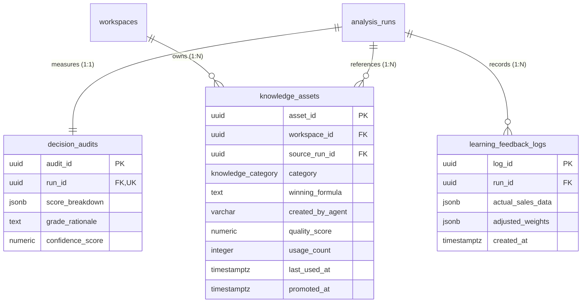

# REVIEW.md (Sprint 2-6 Audit / Learning Domain DDL Review)

본 문서는 **Sprint 2-6 (Audit / Learning Domain DDL)** 완료 후, **ChatGPT (Project Manager)**의 효율적인 코드 리뷰와 승인을 지원하기 위해 자동으로 생성된 스프린트 리뷰 표준 요약서입니다.

---

## 1. Sprint 정보
* **Sprint 번호**: Sprint 2-6
* **대상 Domain**: Audit & Learning Domain (의사결정 분석 로그, Few-shot 지식 자산, 학습 피드백 로그)
* **Commit Message**: `feat(audit): Sprint 2-6 Audit / Learning Domain DDL`

---

## 2. 변경된 파일
이번 스프린트에서 신규 작성된 4대 마이그레이션 DDL 파일 목록입니다.

* [24_audit_tables.sql](file:///Users/kimsanghyeon/Projects/앱개발/naver_shopping_dashboard/database/migrations/24_audit_tables.sql): decision_audits, knowledge_assets, learning_feedback_logs 테이블 생성 및 컬럼 Comments 추가
* [25_audit_constraints.sql](file:///Users/kimsanghyeon/Projects/앱개발/naver_shopping_dashboard/database/migrations/25_audit_constraints.sql): PK, UQ, FK 제약조건 연결 (1:1 유니크 제약조건 및 ON DELETE CASCADE / SET NULL 포함)
* [26_audit_indexes.sql](file:///Users/kimsanghyeon/Projects/앱개발/naver_shopping_dashboard/database/migrations/26_audit_indexes.sql): 조인 및 필터 성능 최적화를 위한 외래키 B-tree 인덱스 생성
* [27_audit_triggers.sql](file:///Users/kimsanghyeon/Projects/앱개발/naver_shopping_dashboard/database/migrations/27_audit_triggers.sql): updated_at 배제 요건에 따른 트리거 생략 명시 및 멱등성 플레이스홀더 파일 작성

---

## 3. 변경 요약
* **정규화 및 관계 규격 수립**:
  * **의사결정 감사 테이블 (`decision_audits`)**: `run_id` 컬럼에 `UNIQUE` 제약조건과 `ON DELETE CASCADE`를 부여하여, 분석 실행 이력(`analysis_runs`)당 단 1건의 의사결정 판정 근거 로그만 존재하도록 1:1 관계를 성립하였습니다.
  * **지식 자산 테이블 (`knowledge_assets`)**: 작업 공간(`workspaces`)에 종속적인 구조이므로 `workspace_id`에 `ON DELETE CASCADE`를 연결하였습니다. 단, 지식의 출처가 된 분석 이력(`source_run_id`)이 삭제되더라도 축적된 지식 자체가 유실되지 않도록 **`ON DELETE SET NULL`** 제약을 부여하여 지식 베이스의 영속성을 확보했습니다.
  * **학습 피드백 로그 테이블 (`learning_feedback_logs`)**: 분석 이력(`run_id`)에 종속되는 피드백 로그로 `ON DELETE CASCADE`를 적용하였습니다.
* **커스텀 Enum 데이터 타입 적용**:
  * `knowledge_assets` 테이블의 `category` 컬럼은 단순 문자열(`VARCHAR`) 대신 Sprint 2-1 (`02_enums.sql`)에 기정의된 **`knowledge_category`** Enum 타입을 사용하여 데이터 입력 시 정합성을 강제하였습니다.
- **인덱싱 최적화**:
  * 아키텍처에 정의된 외래키 B-tree 인덱싱 정책에 따라 `run_id`, `workspace_id`, `source_run_id` 등 모든 외래키 조인 경로에 B-tree 인덱스를 작성하였습니다.
  * 본 도메인의 JSONB 컬럼들(`score_breakdown`, `actual_sales_data`, `adjusted_weights`)은 로그 적재 성격으로 조회 필터/검색 대상에 해당하지 않으므로 GIN 인덱스를 생성하지 않고 배제하여 인덱스 쓰기 오버헤드를 원천 방지했습니다.

---

## 4. Migration 정보
* **생성된 Migration 파일**: `database/migrations/24_audit_tables.sql` ~ `27_audit_triggers.sql`
* **실행 순서**: 파일 번호 순서(24 -> 25 -> 26 -> 27)로 순차 실행됩니다.
* **기존 Migration 수정 여부**:
  > [!IMPORTANT]
  > 기존 스프린트 2-1부터 2-5까지 배포된 01~23번 마이그레이션 파일은 **단 한 줄도 수정하지 않았음**을 보장합니다.

---

## 5. Self Review (자체 검증 결과)
* [x] **PostgreSQL 16 호환**: PostgreSQL 16 표준 DDL 구문과 `gen_random_uuid()` 기본값, Enum 및 Numeric 타입을 안정적으로 준수함.
* [x] **Supabase SQL Editor 실행 가능**: 멱등적 선언(IF NOT EXISTS)과 제약조건 생성 순서를 고려하여 설계함으로써 Supabase 환경에서 충돌 없이 1회 실행 가능함을 검증함.
* [x] **FK 순환참조 없음**: 모든 참조 방향이 상위 도메인 테이블(`workspaces`, `analysis_runs`)을 향하고 하위 테이블 간의 상호 참조가 없어 순환 참조 없음.
* [x] **Trigger 정상 동작**: `updated_at` 컬럼이 없는 이력/로그 성격의 테이블이므로, trigger update를 생략하고 placeholder 주석 파일로 처리함.
* [x] **Migration 순서 오류 없음**: 테이블 생성(24) ➡️ 제약조건(25) ➡️ 인덱스(26) ➡️ 트리거(27) 순서의 선언형 의존 관계를 완벽히 준수함.
* [x] **Index 중복 없음**: 자동 기본키/유니크 인덱스 외에 수동 B-tree 인덱스가 겹치지 않게 설계됨.
* [x] **빈 Database에서 실행 가능**: 01번부터 27번까지 순차 실행 시 외래키 참조 에러나 타입 정의 충돌 없이 원스톱 실행이 가능한 구조임을 보장함.
* [x] **Architecture와 차이 없음**: `database_architecture.md v1.1 Final` 사양에 정의된 컬럼, 타입, NULL 규격과 100% 동일하게 구현됨.

---

## 6. Known Issues
```text
None
```

---

## 7. Review Request (PM 검토 요청 사항)
ChatGPT PM은 효율적인 승인을 위해 아래 핵심 설계 요소를 우선하여 검토해 주십시오.

1. **외래키 삭제(ON DELETE) 정책 차별화**: `decision_audits` 및 `learning_feedback_logs`는 `CASCADE`, `knowledge_assets`는 `SET NULL`을 지정한 삭제 정책의 정당성 검토.
2. **Enum 정합성 강제**: `knowledge_assets.category`에 `knowledge_category` 커스텀 ENUM을 지정하여 정합성을 강제한 방식 검토.
3. **선택적 인덱싱 설계**: JSONB 컬럼에 대한 GIN 인덱스를 배제하고 오직 FK 조인 경로에만 B-tree 인덱스를 부여한 최적화 전략 검토.

---

## 8. Audit / Learning Domain ERD (Entity Relationship Diagram)


---

## 9. 산출물 추가 Summary

| 항목 | 개수 |
| --- | --- |
| Tables | 3 |
| Constraints | 8 |
| Indexes | 4 (B-tree 4, GIN 0) |
| Triggers | 0 (생략 명시) |
