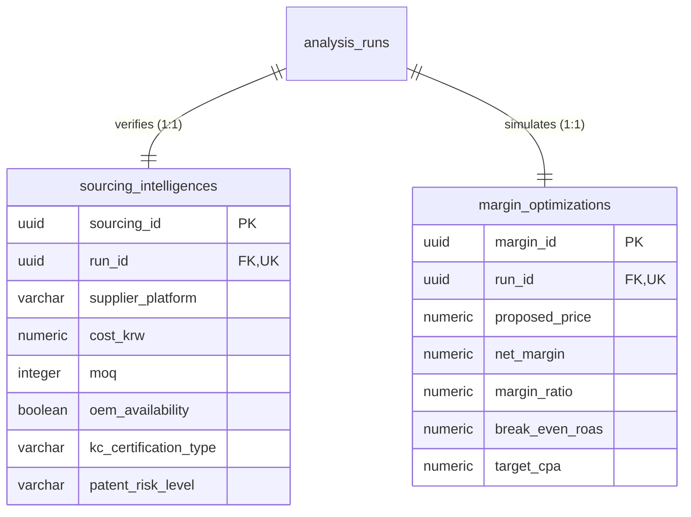

# REVIEW.md (Sprint 2-4 Sourcing / Margin Domain DDL Review)

본 문서는 **Sprint 2-4 (Sourcing / Margin Domain DDL)** 완료 후, **ChatGPT (Project Manager)**의 효율적인 코드 리뷰와 승인을 지원하기 위해 자동으로 생성된 스프린트 리뷰 표준 요약서입니다.

---

## 1. Sprint 정보
* **Sprint 번호**: Sprint 2-4
* **대상 Domain**: Sourcing & Margin Domain (소싱 가용성 정보 및 마진 최적화 시뮬레이션 결과)
* **Commit Message**: `feat(sourcing): Sprint 2-4 Sourcing / Margin Domain DDL`

---

## 2. 변경된 파일
이번 스프린트에서 신규 작성된 4대 마이그레이션 DDL 파일 목록입니다.

* [16_sourcing_tables.sql](file:///Users/kimsanghyeon/Projects/앱개발/naver_shopping_dashboard/database/migrations/16_sourcing_tables.sql): sourcing_intelligences, margin_optimizations 테이블 생성 및 컬럼 Comments 추가
* [17_sourcing_constraints.sql](file:///Users/kimsanghyeon/Projects/앱개발/naver_shopping_dashboard/database/migrations/17_sourcing_constraints.sql): PK, UQ, FK 제약조건 연결 (1:1 유니크 제약조건 포함)
* [18_sourcing_indexes.sql](file:///Users/kimsanghyeon/Projects/앱개발/naver_shopping_dashboard/database/migrations/18_sourcing_indexes.sql): 외래키 참조 속도 최적화를 위한 B-tree 인덱스 생성
* [19_sourcing_triggers.sql](file:///Users/kimsanghyeon/Projects/앱개발/naver_shopping_dashboard/database/migrations/19_sourcing_triggers.sql): 마진 계산 원칙 준수 및 updated_at 배제 요건에 따른 트리거 생략 명시

---

## 3. 변경 요약
* **금액(Money) 및 통화 규칙 엄격 반영**:
  * 소싱 원가(`cost_krw`), 제안 판매가(`proposed_price`), 예상 순마진(`net_margin`), 광고 단가(`target_cpa`) 등 모든 금액 컬럼을 FLOAT, REAL 대신 **NUMERIC** 타입으로 지정하여 부동소수점 오차를 원천 차단했습니다.
  * 금액 컬럼에 별도의 통화 단위 문자열을 저장하지 않고 오직 순수 금액 수치만 NUMERIC으로 적재하도록 정규화했습니다.
* **마진 계산 원칙 준수**: Database 내의 Trigger, Generated Column, Stored Procedure 등에서 마진 계산 연산을 수행하지 않도록 전면 배제했습니다. 계산 로직은 Application Layer에서 수행하여 저장만 담당하는 RDBMS의 상태 저장(State) 역할에 엄격히 집중했습니다.
* **1:1 유니크 매핑 제약 수립**: `sourcing_intelligences`와 `margin_optimizations` 두 테이블의 `run_id` 컬럼에 각각 `UNIQUE` 제약조건을 부여하여, 분석 실행 이력(`analysis_runs`)당 단 1건의 소싱 정보와 마진 모델만 적재되도록 보장했습니다.
* **인덱싱 최적화**: 모든 외래키 조인 경로(`run_id`)에 B-tree 인덱스를 작성하여 고속 조회가 가능하도록 튜닝했습니다.

---

## 4. Migration 정보
* **생성된 Migration 파일**: `database/migrations/16_sourcing_tables.sql` ~ `19_sourcing_triggers.sql`
* **실행 순서**: 파일 번호 순서(16 -> 17 -> 18 -> 19)로 순차 실행됩니다.
* **기존 Migration 수정 여부**:
  > [!IMPORTANT]
  > 기존 스프린트 2-1, 2-2, 2-3에서 배포된 01~15번 마이그레이션 파일은 **단 한 줄도 수정하지 않았음**을 명시합니다.

---

## 5. Self Review (자체 검증 결과)
* [x] **PostgreSQL 16 호환**: PostgreSQL 16 표준 구문 및 Numeric 정밀 연산 자료형 검증 완료.
* [x] **Supabase SQL Editor 실행 가능**: 무결성 에러가 발생하지 않도록 IF NOT EXISTS 및 순차 배치를 보장함.
* [x] **FK 순환참조 없음**: 참조 흐름이 `analysis_runs` ➡️ `sourcing_intelligences` 및 `analysis_runs` ➡️ `margin_optimizations` 단방향으로 구성되어 순환참조 없음.
* [x] **Trigger 정상 동작**: Target 테이블에 `updated_at` 및 데이터베이스 마진 연산 로직이 배제되었으므로 트리거 생략 예외 처리가 올바르게 기입됨.
* [x] **Migration 순서 오류 없음**: 테이블 생성 ➡️ 제약조건 ➡️ 인덱스 ➡️ 트리거의 엄격한 선언식 배치를 준수함.
* [x] **Index 중복 없음**: 묵시적 기본키/유니크 인덱스 외에 수동 인덱스가 중복 생성되지 않음을 검증함.
* [x] **빈 Database에서 실행 가능**: 01번부터 19번까지 순차 실행 시 외래키 참조 에러 없이 원스톱 실행 가능.
* [x] **Architecture와 차이 없음**: `database_architecture.md v1.1 Final` 사양에 정의된 컬럼 크기, NULL 규격과 완전히 일치하게 구현됨.

---

## 6. Known Issues
```text
None
```

---

## 7. Review Request (PM 검토 요청 사항)
ChatGPT PM은 효율적인 승인을 위해 아래 핵심 설계 요소를 우선하여 검토해 주십시오.

1. **금액 데이터 NUMERIC 규격**: 모든 원가, 판매가 및 광고비 컬럼의 `NUMERIC` 데이터 타입 지정의 적절성 검토.
2. **마진 계산 원칙 준수**: DB 단의 연산(SP, Trigger, Generated Column)을 생략한 결정이 비즈니스 요구사항과 적합한지 여부 검토.
3. **UNIQUE 1:1 관계 설정**: `run_id`에 할당된 UNIQUE 제약조건을 통한 분석 모델 격리성 검토.

---

## 8. Sourcing / Margin Domain ERD (Entity Relationship Diagram)


---

## 9. 산출물 추가 Summary

| 항목 | 개수 |
| --- | --- |
| Tables | 2 |
| Constraints | 6 |
| Indexes | 2 |
| Triggers | 0 (생략 명시) |
