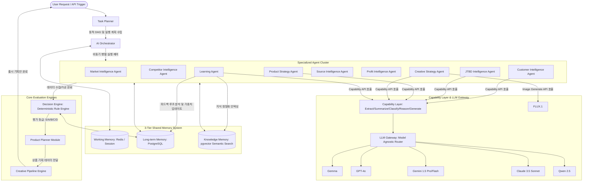

# AI Agent Architecture v1.1: Final Development Specification

이 문서는 **AI Product Intelligence Platform**을 구현하기 위한 최상위 멀티 에이전트 시스템 아키텍처 명세서(System Specification)입니다. 향후 데이터베이스 설계, API 구현, 백엔드 코드 작성 및 개별 Agent 프롬프트 엔지니어링의 기준 규격서로 사용됩니다.

---

## 1. 플랫폼 아키텍처 토폴로지 (System Topology)

전체 시스템 흐름은 동적으로 구성된 비동기식 메시징 통신 및 중앙 제어 오케스트레이션을 기반으로 작동합니다.



---

## 2. Task Planner (작업 계획기)

* **역할**: 사용자의 요청(Natural Language or API Payload)의 의도를 파악하여, 분석 실행에 불필요한 연산을 제거하고 실행이 필수적인 Agent 목록과 우선순위를 결정하는 **동적 DAG(Directed Acyclic Graph) 실행 계획기**입니다.
* **라우팅 매핑 규칙**:

| 요청 유형 (Intent) | 실행할 에이전트 목록 (DAG Sequence) | 비고 |
| :--- | :--- | :--- |
| **전체 상품성 분석** | `Market` ➡️ `Competitor` ➡️ `Customer` ➡️ `JTBD` ➡️ `Source` ➡️ `Profit` ➡️ `Learning` | 기본 풀 패키지 파이프라인 작동 |
| **신규 상품 기획 및 전략 생성** | `JTBD` ➡️ `Source` ➡️ `Profit` ➡️ `Product Strategy` ➡️ `Creative Strategy` | 기 구축된 시장 조사 메모리를 활용하여 기획만 전개 |
| **리뷰 분석 및 결핍 추출** | `Customer` ➡️ `JTBD` ➡️ `Product Strategy` | 정량 데이터 수집 및 가격 최적화 생략 |
| **비주얼 소재/카피 생성** | `Creative Strategy` | 기획 아웃풋 기준 썸네일/상세페이지 스토리보드 단독 재생성 |

---

## 3. AI Orchestrator (인공지능 오케스트레이터)

* **역할**: Task Planner가 발행한 DAG 실행 계획을 바탕으로 각 Specialized Agent의 생명 주기를 제어하고, 병렬 비동기 입출력을 처리하는 **오케스트레이션 엔진**입니다.
* **핵심 기능 규격**:
  1. **Async Parallel Execution (비동기 병렬 처리)**: `Market`, `Competitor`, `Source` 등 외부 크롤러 및 API를 호출하는 독립 에이전트들을 비동기(`asyncio`) 병렬 처리하여 대기 시간을 최소화합니다.
  2. **Context Propagation (컨텍스트 전파)**: `Working Memory`를 활용하여 에이전트 간 처리 결과를 누적 저장하고, 후속 에이전트가 이전 실행 결과를 의존성 주입(Dependency Injection) 형태로 전달받도록 설계합니다.
  3. **Fault Tolerance & Reliability**:
     - **Timeout**: 각 Agent 호출 단계별 최대 대기 제한 시간(예: LLM API 호출 30초, 크롤러 60초)을 강제합니다.
     - **Retry Policy**: API 오류 또는 레이트 리밋(Rate Limit) 감지 시 지수 백오프(Exponential Backoff)를 적용한 최대 3회 재시도를 자동 실행합니다.
     - **Error Boundary**: 특정 에이전트(예: SNS 크롤링 실패)가 에러로 다운되더라도, 전체 파이프라인이 즉시 실패하지 않고 **Fallback 데이터(최소 정보 또는 캐시 데이터)**를 적용해 정상 구동을 유지합니다.

---

## 4. Specialized Agents Specification

모든 에이전트는 독립적인 모듈 구조를 유지하며, 테스트 가능하도록 구성됩니다.

---

### [1] Market Intelligence Agent
* **역할**: 대상 키워드의 정량적 시장 수요 데이터를 수집 및 연산합니다.
* **책임**: 검색량 데이터 확인, 시즌별 추세 분석, 시장 성장률 산출.
* **Engine Type**: **Python Native Rule Engine** (LLM 호출 금지)
* **Input Schema**:
  ```json
  {"keyword": "string", "target_period_months": "integer"}
  ```
* **Output Schema**:
  ```json
  {"monthly_avg_search": "integer", "trend_classification": "string", "slope": "float"}
  ```
* **Retry / Error Policy**: API 실패 시 기존 `Long-term Memory`에 캐시된 30일 이내 데이터를 Fallback으로 반환합니다.

---

### [2] Competitor Intelligence Agent
* **역할**: 현재 시장에 상주하는 경쟁사들의 진입 장벽 지표를 산출합니다.
* **책임**: 상위 판매처들의 브랜드 점유율 통계, 평균 평점/리뷰 수 분석, 신규 진입 셀러 비율 탐지.
* **Engine Type**: **Python Native Rule Engine + SQL Query** (LLM 호출 금지)
* **Input Schema**:
  ```json
  {"top_product_list": "array of objects"}
  ```
* **Output Schema**:
  ```json
  {"brand_monopoly_ratio": "float", "fluidity_score": "integer", "review_barrier_level": "string"}
  ```
* **Retry / Error Policy**: 타겟 몰 스크래핑 차단 시, 2순위 쇼핑 채널(예: 쿠팡 또는 기존 DB)에서 데이터를 수집하는 Fallback 정책 적용.

---

### [3] Customer Intelligence Agent
* **역할**: 구매자들의 실제 평판 데이터를 스크리닝하여 불만과 부정적 피드백의 핵심 키워드를 도출합니다.
* **책임**: 부정 리뷰 감성 분석(Sentiment Analysis), 카테고리별 불만 빈도 집계.
* **Engine Type**: **LLM Engine (Gemini Flash / Qwen)**
* **Input Schema**:
  ```json
  {"raw_reviews": "array of strings"}
  ```
* **Output Schema**:
  ```json
  {"pain_point_hierarchy": [{"category": "string", "ratio": "float", "description": "string"}]}
  ```
* **Retry / Error Policy**: LLM 타임아웃 발생 시, 단순 정량 텍스트 분석(TF-IDF 기반 다빈도 단어 추출 Python 코드)으로 즉시 Fallback 처리합니다.

---

### [4] JTBD Intelligence Agent
* **역할**: 고객이 어떤 맥락에서 해당 제품을 고용하는지 상황적 요소를 모델링합니다.
* **책임**: Context, Job, Persona, Usage Scenario, Purchase Trigger, Emotional Outcome 도출.
* **Engine Type**: **LLM Engine (Claude 3.5 Sonnet / GPT-4o)**
* **Input Schema**:
  ```json
  {"keyword": "string", "unmet_needs": "array of string", "customer_pain_points": "object"}
  ```
* **Output Schema**:
  ```json
  {
    "context": "string", "job": "string", "persona": "object", 
    "scenario": "array", "trigger": "string", "emotional_outcome": "string"
  }
  ```
* **Cache**: `Knowledge Memory`와 매칭하여 85% 이상 유사한 환경의 기존 분석 이력이 있다면 캐시된 JTBD 프레임워크 스키마를 재사용합니다.

---

### [5] Source Intelligence Agent
* **역할**: 제품 생산/소싱 가용성 및 해외 수입 단가를 탐색합니다.
* **책임**: 해외 공급처(1688 등) 단가 매칭, 최소주문수량(MOQ) 산출, KC인증 및 지식재산권 리스크 검증.
* **Engine Type**: **Python Crawler + LLM Translation & Screening Engine**
* **Input Schema**:
  ```json
  {"target_specs": "object", "search_query": "string"}
  ```
* **Output Schema**:
  ```json
  {
    "unit_cost_usd": "float", "moq": "integer", "oem_capable": "boolean",
    "kc_required": "boolean", "kc_type": "string", "patent_risk": "string"
  }
  ```
* **Error Policy**: 1688 크롤러가 블록될 경우 알리바바 오픈 API 및 국내 도매처 공급 단가를 대안(Fallback)으로 적용합니다.

---

### [6] Profit Intelligence Agent
* **역할**: 원가 대비 광고 마진 및 손익분기점(BEP)을 계산하여 재무 타당성을 도출합니다.
* **책임**: 판매 예정 가격 계산, 공제 마진 시뮬레이션, Break-Even ROAS 산정.
* **Engine Type**: **Python Native Rule Engine** (LLM 호출 금지)
* **Input Schema**:
  ```json
  {"sourcing_cost": "integer", "shipping_fee": "integer", "proposed_price": "integer"}
  ```
* **Output Schema**:
  ```json
  {"net_margin": "integer", "margin_ratio": "float", "be_roas": "float", "target_cpa": "integer"}
  ```

---

### [7] Product Strategy Agent
* **역할**: 검증된 지표를 기반으로 상품 기획 및 차별화 포지셔닝 보고서를 구성합니다.
* **책임**: 핵심 USP 카피 설계, 패키징 변경 사양 제안, 유통 채널별 판매 전략 설계.
* **Engine Type**: **LLM Engine (Claude 3.5 Sonnet / Gemini Pro)**
* **Input Schema**:
  ```json
  {"jtbd_profile": "object", "margin_data": "object", "sourcing_intelligence": "object"}
  ```
* **Output Schema**:
  ```json
  {"recommended_target": "string", "concept": "string", "usps": "array", "pricing_strategy": "object"}
  ```

---

### [8] Creative Strategy Agent
* **역할**: 기획된 제품의 광고 노출용 썸네일과 구매 유도 상세페이지 레이아웃을 기획하고 생성 프롬프트를 빌드합니다.
* **책임**: 카피라이팅 초안, 이미지 생성용 프롬프트 생성, 상세페이지 8단계 스토리보드 빌드.
* **Engine Type**: **LLM Engine + FLUX API Gateway**
* **Input Schema**:
  ```json
  {"product_strategy": "object"}
  ```
* **Output Schema**:
  ```json
  {
    "hero_copy": "string", "thumbnail_guide": "object", 
    "flux_image_prompt": "string", "landing_page_storyboard": "array"
  }
  ```

---

### [9] Learning Agent
* **역할**: 출시 이후 수집되는 실제 판매 데이터와 AI 기획 데이터를 상호 비교 분석합니다.
* **책임**: 광고비 지출 대비 효율 분석, 반품 사유 패턴 파악, 대시보드 코어 평가 가중치 변수 갱신.
* **Engine Type**: **Python Statistical Analysis + LLM Assistant**
* **Input Schema**:
  ```json
  {"evaluated_data": "object", "actual_sales_data": "object"}
  ```
* **Output Schema**:
  ```json
  {"accuracy_score": "float", "adjusted_weights": "object", "reason_for_variance": "string"}
  ```

---

## 5. Capability Layer & LLM Gateway (인프라 추상화)

에이전트는 LLM의 API 명세서나 라이브러리를 직접 다루지 않고 **인프라 추상화 레이어**를 통해 요청을 수행합니다.

```
┌──────────────────────────────────────────────────────────────┐
│                      Capability Layer                        │
│  - Extract()     - Summarize()   - Classify()                │
│  - Reason()      - Generate()                                │
└──────────────────────────────┬───────────────────────────────┘
                               ▼
┌──────────────────────────────────────────────────────────────┐
│                        LLM Gateway                           │
│  - Load Balancing     - Provider Failover    - Token Caching │
└──────────────────────────────┬───────────────────────────────┘
                               ▼
            [Gemini / Claude / GPT / Qwen / FLUX]
```

* **Capability Layer**: LLM이 가장 잘 처리할 수 있는 과업 유형별로 함수형 인터페이스를 제공하여, 에이전트의 결합도를 낮춥니다.
* **LLM Gateway**: 
  - 특정 모델 서버 장애 또는 속도 저하 발생 시 자동으로 예비 모델로 요청을 라우팅하는 **Provider Failover** 기능을 내장합니다. (예: Claude 타임아웃 발생 시 Gemini Pro로 500ms 이내 스위칭)
  - 동일한 입력 프롬프트가 들어올 시 LLM 호출 없이 토큰 캐시(Token Cache)를 사용해 비용과 반응 속도를 최적화합니다.

---

## 6. Deterministic Decision Engine (의사결정 엔진)

AI의 무작위성(Hallucination)으로 인한 잘못된 투자 판단을 방지하기 위해, 최종 등급 판정은 완전한 **결정론적 룰 엔진(Deterministic Rule Engine)**으로 분리하여 작동합니다.

### 등급 판정 기준 수식
최종 점수는 각 단계별 정량 지표와 기술적 타당성에 부여된 가중치의 합으로 도출됩니다.

$$TotalScore = (W_{demand} \times S_{demand}) + (W_{barrier} \times S_{barrier}) + (W_{pain} \times S_{pain}) + (W_{sourcing} \times S_{sourcing}) + (W_{profit} \times S_{profit})$$

* 각 지표 점수($S$)는 `0 ~ 100`점 사이의 환산값을 가지며, 가중치($W$)의 총합은 `1.0`입니다.
* **강제 컷오프(Hard Cut-off) 규칙**:
  - 만약 특허권 위반 리스크가 `HIGH`이거나 순마진율이 `20% 미만`일 경우, $TotalScore$에 관계없이 즉시 **D등급(진입 금지)**으로 하락 처리됩니다.

### Confidence Score (신뢰도 점수) 연산
* 크롤링된 정보의 최신성, 분석 대상 리뷰의 표본 수 등을 활용해 신뢰 지수를 산정합니다.
* **Confidence Score < 65%**일 경우, 의사결정 엔진은 최종 결정을 보류하고 오케스트레이터에게 **"수집 데이터 표본 부족으로 인한 재분석(Recrawl)"** 플래그를 응답으로 보냅니다.

---

## 7. 3-Tier Shared Memory System (공유 메모리 시스템)

에이전트가 생성한 결과와 지식을 정형화하여 재사용율을 극대화합니다.

```
┌──────────────────────────────────────────────────────────────┐
│  1. Working Memory (Active State)                            │
│  - DAG 실행 중인 임시 데이터 파이프라인 (Redis / 세션 메모리)       │
└──────────────────────────────┬───────────────────────────────┘
                               ▼
┌──────────────────────────────────────────────────────────────┐
│  2. Long-term Memory (Structured Database)                   │
│  - 누적 분석 이력, 상품 테이블, 수집 로그 (Supabase PostgreSQL)  │
└──────────────────────────────┬───────────────────────────────┘
                               ▼
┌──────────────────────────────────────────────────────────────┐
│  3. Knowledge Memory (Semantic Index)                        │
│  - 성공적인 USP 유형, 산업군별 JTBD 사전 (pgvector 임베딩 검색)   │
└──────────────────────────────────────────────────────────────┘
```

* **Knowledge Memory 활용 시나리오**:
  - '차량용 서큘레이터' 분석 시작 시, `Knowledge Memory`에서 '차량용선풍기', '차량용에어컨'의 기존 JTBD 프로필을 벡터 유사도 검색으로 조회합니다.
  - 이를 통해 이미 검증된 페르소나와 사용 시나리오 정보를 프롬프트 컨텍스트에 추가하여, 탐색 비용을 절반 이하로 줄이고 분석 정확도를 90% 이상으로 끌어올립니다.

---

## 8. Agent Communication Protocol & Error Handling

### 표준 통신 포맷 (Standard Interface)
모든 에이전트 간 데이터 입출력은 Pydantic에 의한 검증(Validation)을 통과해야 합니다.
```python
from pydantic import BaseModel, Field
from typing import List, Optional

class SourcingIntelligence(BaseModel):
    platform: str = Field(..., description="소싱 대상 플랫폼 (1688 | 알리바바 등)")
    unit_cost_usd: float = Field(..., gte=0.0, description="공급 단가")
    moq: int = Field(..., gt=0, description="최소 주문 수량")
    kc_required: bool = Field(default=False)
    patent_risk: str = Field(default="LOW", regex="^(HIGH|MEDIUM|LOW)$")
```

### Error Handling & Fallback 전략 매트릭스

| 에러 유형 | 일차적 대응책 (Retry/Mitigation) | 차선책 (Fallback Strategy) |
| :--- | :--- | :--- |
| **API Timeout / Rate Limit** | 지수 백오프 적용 3회 재시도 | LLM Gateway가 예비 모델(예: Gemini ➡️ Qwen)로 즉시 전환 |
| **Pydantic Validation Fail** | 에러 파싱 후 LLM에 재정형 요청 (Refinement Prompt) | 해당 필드 디폴트(Default) 값 채운 후 정상 파이프라인 전송 |
| **Sourcing Crawler Block** | IP 로테이션 프록시 스위칭 | 타사 B2B 사이트 간접 가격 비교 또는 기존 캐시 메모리 로드 |
| **Naver Shopping API Fail** | 엣지 크롤러 스위칭 | 쿠팡 쇼핑 스크랩 데이터로 보완 ➡️ 최소 데이터 기반 추정 분석 |
