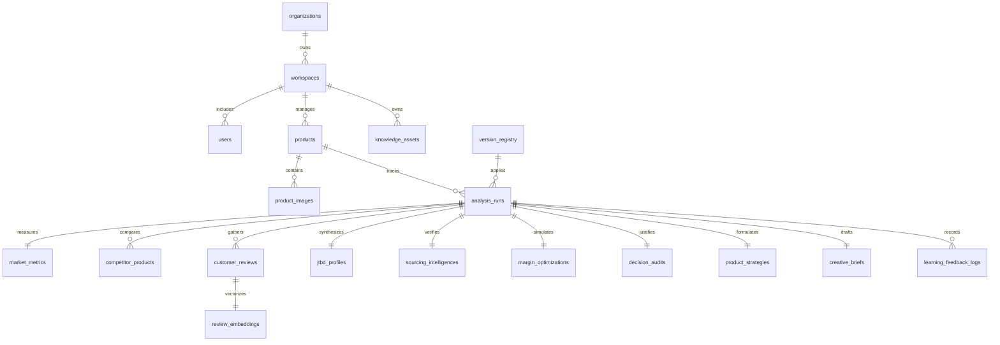

# Database Architecture Specification v1.1 Final

이 문서는 **AI Product Intelligence Platform**의 최종 확정(Freeze)된 데이터베이스 아키텍처 명세서입니다. 본 명세서는 단순한 개념 수립을 넘어 실제 Production SaaS 다중 테넌트(Multi-Tenant) 환경에서 100만 이상의 상품과 수억 건의 리뷰, 대규모 벡터 임베딩 데이터를 성능 저하 없이 운용하기 위한 실성능형 인프라 모델링을 수록하고 있습니다.

---

## 1. Architecture Freeze 선언 (아키텍처 확정 선언)

> **[선언문]**
> 본 Database Architecture v1.1은 AI Product Intelligence Platform의 코어 영속성 규격으로 최종 확정(Final Freeze)되었습니다. 이후 진행될 DDL 쿼리 빌드, API 설계, Repository 패턴 구현, 비동기 수집기(Playwright) 개발 및 대시보드 UI 연계 단계에서는 본 문서에 정의된 데이터 모델과 엔티티 관계를 임의로 수정하지 않는 것을 원칙으로 합니다.
> 
> 설계 변경이 필요할 경우, 직접 수정은 전면 금지하며 반드시 **Architecture Review Proposal** 문서를 통한 정식 제안 및 의결 절차를 거쳐 반영합니다.

---

## 2. Database Topology & Multi-Tenant Partitioning

본 시스템은 다중 테넌시(Multi-Tenancy) 구조 하에서 테넌트 간의 완벽한 데이터 격리와 고속 Retrieval을 보장하기 위해 다음과 같이 저장 구조를 세분화합니다.

```
                  [User Request / OAuth]
                             │
                             ▼
 ┌───────────────────────────────────────────────────────┐
 │             SaaS Multi-Tenant 분리 계층                │
 │  organizations ➡️ workspaces ➡️ users ➡️ products     │
 └───────────────────────────┬───────────────────────────┘
                             │
       ┌─────────────────────┴─────────────────────┐
       ▼                                           ▼
 ┌───────────────────────────┐               ┌───────────────────────────┐
 │   Operational Storage     │               │     Knowledge Memory      │
 │  - PostgreSQL Core Tables │               │  - pgvector Embedding Col │
 │  - RDBMS 정규화 및 제약조건│               │  - HNSW Index / Cosine    │
 └─────────────┬─────────────┘               └─────────────┬─────────────┘
               │                                           │
               └─────────────────────┬─────────────────────┘
                                     │
                                     ▼
 ┌───────────────────────────────────────────────────────┐
 │            Partitioned Analytics Storage              │
 │  - customer_reviews (Range Partitioned by month)     │
 │  - learning_feedback_logs (Partitioned)               │
 └───────────────────────────────────────────────────────┘
```

* **Tenant Isolation (테넌트 격리)**: 모든 상품, 기획, 소싱, 마진 정보는 `workspace_id`를 기준으로 논리 격리됩니다.
* **Partitioning Strategy (파티셔닝)**: 데이터 유입량이 가장 방대한 `customer_reviews` 및 `review_embeddings` 테이블은 수집 일자(`collected_at`)를 기준으로 월별 범위 파티셔닝(Range Partitioning)을 구성하여 인덱스 크기를 제한하고 검색 속도를 보장합니다.

---

## 3. Core Domain Hierarchy & ERD (엔티티 관계도)

본 설계는 기존의 `AnalysisRun` 중심에서 **`Product(상품)` 중심의 도메인 구조**로 전면 전환되었습니다. 분석 실행(`AnalysisRun`)은 해당 상품이 거쳐 간 시계열 이력 레코드로 정의됩니다.

### Entity Relationship Diagram (Mermaid)



---

## 4. Entity Specification & Ownership Ledger (엔티티 명세 및 라이프사이클)

각 엔티티는 소유 에이전트(Owner Agent)를 가지며, 라이프사이클(생성, 수정, 삭제, 보존 정책)이 엄격하게 관리됩니다.

### 4-1. SaaS Tenant Domain

#### 1) `organizations`
* **설명**: 최상위 고객 회사/단체 계정.
* **Owner**: System Operator
* **Lifecycle**: 생성 시점(회원가입), 수정 주체(대표 계정), 삭제(영구 삭제 시 탈퇴 처리), 보존 기간(영구).
* **Fields**:
  - `org_id` UUID (Primary Key, 기본값 `gen_random_uuid()`)
  - `name` VARCHAR(100) NOT NULL
  - `created_at` TIMESTAMPTZ NOT NULL DEFAULT NOW()
  - `updated_at` TIMESTAMPTZ NOT NULL DEFAULT NOW()

#### 2) `workspaces`
* **설명**: 조직 내 독립된 프로젝트/브랜드 단위 작업 공간.
* **Owner**: System Operator
* **Lifecycle**: 생성 시점(PO 생성 요청), 삭제 정책(Workspace 삭제 시 하위 모든 products, runs 연쇄 삭제 CASCADE).
* **Fields**:
  - `workspace_id` UUID (Primary Key, 기본값 `gen_random_uuid()`)
  - `org_id` UUID NOT NULL (Foreign Key referencing `organizations.org_id` ON DELETE CASCADE)
  - `name` VARCHAR(100) NOT NULL
  - `created_at` TIMESTAMPTZ NOT NULL DEFAULT NOW()
  - `updated_at` TIMESTAMPTZ NOT NULL DEFAULT NOW()

#### 3) `users`
* **설명**: 플랫폼 사용자 및 권한 관리.
* **Owner**: System Operator
* **Fields**:
  - `user_id` UUID (Primary Key)
  - `workspace_id` UUID NOT NULL (Foreign Key referencing `workspaces.workspace_id` ON DELETE CASCADE)
  - `email` VARCHAR(255) UNIQUE NOT NULL
  - `role` VARCHAR(20) NOT NULL DEFAULT 'member' (Admin | Member | Viewer)
  - `created_at` TIMESTAMPTZ NOT NULL DEFAULT NOW()

---

### 4-2. Product Domain (신규 추가 및 Product 중심 개편)

#### 4) `products`
* **설명**: 분석 및 마케팅 기획의 대상이 되는 핵심 상품 엔티티.
* **Owner**: Task Planner
* **Lifecycle**: 생성 시점(최초 키워드 또는 상품명 입력 분석 요청 시), 수정 주체(Antigravity Backend), 삭제 정책(Soft Delete 적용 - `deleted_at` 보존).
* **Fields**:
  - `product_id` UUID (Primary Key, 기본값 `gen_random_uuid()`)
  - `workspace_id` UUID NOT NULL (Foreign Key referencing `workspaces.workspace_id` ON DELETE CASCADE)
  - `keyword` VARCHAR(100) NOT NULL (분석 기준 핵심 키워드)
  - `name` VARCHAR(255) NOT NULL (상품명)
  - `status` VARCHAR(20) NOT NULL DEFAULT 'ACTIVE' (Active | Archival | Deleted)
  - `deleted_at` TIMESTAMPTZ NULL
  - `created_at` TIMESTAMPTZ NOT NULL DEFAULT NOW()
  - `updated_at` TIMESTAMPTZ NOT NULL DEFAULT NOW()

#### 5) `product_images`
* **설명**: 상품 썸네일 및 참고 시각 자료 이미지 목록.
* **Owner**: Creative Strategy Agent
* **Fields**:
  - `image_id` UUID (Primary Key, 기본값 `gen_random_uuid()`)
  - `product_id` UUID NOT NULL (Foreign Key referencing `products.product_id` ON DELETE CASCADE)
  - `image_url` TEXT NOT NULL
  - `is_representative` BOOLEAN NOT NULL DEFAULT FALSE (대표 이미지 여부)
  - `created_at` TIMESTAMPTZ NOT NULL DEFAULT NOW()

---

### 4-3. Analysis Run Domain

#### 6) `analysis_runs`
* **설명**: 특정 상품에 대해 수행된 시계열 분석 실행 이력 (과거 기획 히스토리 보존).
* **Owner**: AI Orchestrator
* **Lifecycle**: 생성 시점(분석 시작 시 `RUNNING`), 수정(분석 성공 시 `COMPLETED` 및 등급 업데이트), 삭제(삭제 불가, 영구 보존).
* **Fields**:
  - `run_id` UUID (Primary Key, 기본값 `gen_random_uuid()`)
  - `product_id` UUID NOT NULL (Foreign Key referencing `products.product_id` ON DELETE CASCADE)
  - `version_id` UUID NOT NULL (Foreign Key referencing `version_registry.version_id`)
  - `run_number` INTEGER NOT NULL (상품별 차수 관리)
  - `status` VARCHAR(20) NOT NULL DEFAULT 'RUNNING' (Running | Completed | Failed)
  - `evaluation_grade` VARCHAR(2) NULL (S | A | B | C | D)
  - `confidence_score` NUMERIC(5,2) NULL
  - `started_at` TIMESTAMPTZ NOT NULL DEFAULT NOW()
  - `completed_at` TIMESTAMPTZ NULL

---

### 4-4. Market & Competitor Domain

#### 7) `market_metrics`
* **설명**: 시장 전체 정량 수요 통계.
* **Owner**: Market Intelligence Agent (Python Rule Engine)
* **Fields**:
  - `metric_id` UUID (Primary Key)
  - `run_id` UUID UNIQUE NOT NULL (Foreign Key referencing `analysis_runs.run_id` ON DELETE CASCADE)
  - `total_monthly_search` INTEGER NOT NULL
  - `trend_slope` NUMERIC(6,3) NOT NULL
  - `seasonality_classification` VARCHAR(20) NOT NULL
  - `raw_trend_json` JSONB NOT NULL (역정규화 캐시 데이터)

#### 8) `competitor_products`
* **설명**: 수집 시점 상위 경쟁사들의 포지셔닝 지표.
* **Owner**: Competitor Intelligence Agent (Python Rule Engine)
* **Fields**:
  - `comp_product_id` UUID (Primary Key)
  - `run_id` UUID NOT NULL (Foreign Key referencing `analysis_runs.run_id` ON DELETE CASCADE)
  - `rank` INTEGER NOT NULL
  - `brand_name` VARCHAR(100) NOT NULL
  - `mall_type` VARCHAR(50) NOT NULL
  - `price` INTEGER NOT NULL
  - `review_count` INTEGER NOT NULL
  - `raw_mall_name` VARCHAR(100) NULL

---

### 4-5. Customer Review Domain (리뷰 및 임베딩 독립 분리)

#### 9) `customer_reviews`
* **설명**: 수집된 고객 원본 텍스트 데이터.
* **Owner**: Customer Intelligence Agent
* **Lifecycle**: 범위 파티셔닝 적용. 보존 기간 3년 후 자동 Archive/Drop.
* **Fields**:
  - `review_id` UUID NOT NULL
  - `run_id` UUID NOT NULL (Foreign Key referencing `analysis_runs.run_id` ON DELETE CASCADE)
  - `raw_text` TEXT NOT NULL
  - `rating` INTEGER NOT NULL
  - `collected_at` TIMESTAMPTZ NOT NULL DEFAULT NOW()
  - **Constraints**: Composite Primary Key (`review_id`, `collected_at`) 구성 (파티셔닝 조건)

#### 10) `review_embeddings` (분리 완료)
* **설명**: AI 분석의 자유도를 높이기 위해 분리된 독립 고차원 벡터 임베딩 테이블.
* **Owner**: Customer Intelligence Agent / LLM Gateway
* **Fields**:
  - `embedding_id` UUID NOT NULL
  - `review_id` UUID NOT NULL
  - `vector_embedding` vector(1536) NOT NULL (HNSW Index 적용 대상)
  - `collected_at` TIMESTAMPTZ NOT NULL DEFAULT NOW()
  - **Constraints**: Composite Primary Key (`embedding_id`, `collected_at`), Foreign Key referencing `customer_reviews` (복합키 맵핑 ON DELETE CASCADE)

---

### 4-6. JTBD & Sourcing Domain

#### 11) `jtbd_profiles`
* **설명**: 감성 불만을 분석하여 모델링한 고객 과업 정의서.
* **Owner**: JTBD Intelligence Agent (LLM)
* **Fields**:
  - `jtbd_id` UUID (Primary Key)
  - `run_id` UUID UNIQUE NOT NULL (Foreign Key referencing `analysis_runs.run_id` ON DELETE CASCADE)
  - `context` TEXT NOT NULL
  - `job` TEXT NOT NULL
  - `persona` JSONB NOT NULL (역정규화: 빠른 LLM 조회를 위해 JSON 포맷 보존)
  - `usage_scenario` JSONB NOT NULL (역정규화)
  - `purchase_trigger` TEXT NOT NULL
  - `emotional_outcome` TEXT NOT NULL

#### 12) `sourcing_intelligences`
* **설명**: 실제 소싱 가용성 정보 및 위험 요소 진단서.
* **Owner**: Source Intelligence Agent (Playwright/LLM)
* **Fields**:
  - `sourcing_id` UUID (Primary Key)
  - `run_id` UUID UNIQUE NOT NULL (Foreign Key referencing `analysis_runs.run_id` ON DELETE CASCADE)
  - `supplier_platform` VARCHAR(50) NOT NULL (1688 | Alibaba | Domestic)
  - `cost_krw` INTEGER NOT NULL
  - `moq` INTEGER NOT NULL
  - `oem_availability` BOOLEAN NOT NULL DEFAULT FALSE
  - `kc_certification_type` VARCHAR(100) NOT NULL
  - `patent_risk_level` VARCHAR(20) NOT NULL (HIGH | MEDIUM | LOW)

---

### 4-7. Margin & Strategy Domain

#### 13) `margin_optimizations`
* **설명**: 가격대별 예상 시뮬레이션 마진 모델.
* **Owner**: Profit Intelligence Agent (Python Rule Engine)
* **Fields**:
  - `margin_id` UUID (Primary Key)
  - `run_id` UUID UNIQUE NOT NULL (Foreign Key referencing `analysis_runs.run_id` ON DELETE CASCADE)
  - `proposed_price` INTEGER NOT NULL
  - `net_margin` INTEGER NOT NULL
  - `margin_ratio` NUMERIC(4,2) NOT NULL
  - `break_even_roas` NUMERIC(6,2) NOT NULL
  - `target_cpa` INTEGER NOT NULL

#### 14) `product_strategies`
* **설명**: 등급 통과 제품에 한해 수립된 상품화 기획 보고서.
* **Owner**: Product Strategy Agent (LLM)
* **Fields**:
  - `strategy_id` UUID (Primary Key)
  - `run_id` UUID UNIQUE NOT NULL (Foreign Key referencing `analysis_runs.run_id` ON DELETE CASCADE)
  - `target_segment` JSONB NOT NULL
  - `product_concept` JSONB NOT NULL
  - `core_usps` JSONB NOT NULL

#### 15) `creative_briefs`
* **설명**: 썸네일 디자인 지침 및 상세페이지(랜딩페이지) 기획서.
* **Owner**: Creative Strategy Agent (LLM)
* **Fields**:
  - `brief_id` UUID (Primary Key)
  - `run_id` UUID UNIQUE NOT NULL (Foreign Key referencing `analysis_runs.run_id` ON DELETE CASCADE)
  - `hero_copy` TEXT NOT NULL
  - `storyboard` JSONB NOT NULL (8단계 상세페이지 흐름)
  - `thumbnail_guide` JSONB NOT NULL

---

### 4-8. Knowledge Domain (지식 자산 메타데이터 강화)

#### 16) `knowledge_assets`
* **설명**: 판매 성과가 증명되어 AI의 Few-shot 지식 사전에 등록된 검증된 지식 에셋.
* **Owner**: Learning Agent (승격 처리)
* **Lifecycle**: `promoted_at` 시점에 등록되며, `usage_count`를 추적하여 쓸모없는 지식은 아카이브 처리.
* **Fields**:
  - `asset_id` UUID (Primary Key, 기본값 `gen_random_uuid()`)
  - `workspace_id` UUID NOT NULL (Foreign Key referencing `workspaces.workspace_id` ON DELETE CASCADE)
  - `source_run_id` UUID NULL (Foreign Key referencing `analysis_runs.run_id` ON DELETE SET NULL)
  - `category` VARCHAR(50) NOT NULL (JTBD_PATTERN | USP_FORMULA | COPY_SUCCESS)
  - `winning_formula` TEXT NOT NULL
  - `created_by_agent` VARCHAR(50) NOT NULL (에셋 생성 주체 Agent 명시)
  - `quality_score` NUMERIC(4,2) NOT NULL DEFAULT 0.00 (지식의 등급/성공 기여 점수)
  - `usage_count` INTEGER NOT NULL DEFAULT 0
  - `last_used_at` TIMESTAMPTZ NULL
  - `promoted_at` TIMESTAMPTZ NOT NULL DEFAULT NOW()

---

### 4-9. Audit & Versions Domain

#### 17) `decision_audits`
* **설명**: 등급 판정(S~D) 시 룰 엔진이 가중 연산한 결과 및 근거 보존.
* **Owner**: Decision Engine (Deterministic Rule Engine)
* **Fields**:
  - `audit_id` UUID (Primary Key)
  - `run_id` UUID UNIQUE NOT NULL (Foreign Key referencing `analysis_runs.run_id` ON DELETE CASCADE)
  - `score_breakdown` JSONB NOT NULL (가중치 계산 세부 결과 로그)
  - `grade_rationale` TEXT NOT NULL
  - `confidence_score` NUMERIC(5,2) NOT NULL

#### 18) `version_registry` (버전 관리 전면 보완)
* **설명**: 분석 실행 시점에 사용된 모든 컴포넌트의 소프트웨어 및 프롬프트 버전 관리 상태 보존.
* **Owner**: AI Orchestrator
* **Fields**:
  - `version_id` UUID (Primary Key, 기본값 `gen_random_uuid()`)
  - `prompt_version` VARCHAR(50) NOT NULL (사용된 프롬프트 릴리즈 버전)
  - `rule_engine_version` VARCHAR(50) NOT NULL (룰 가중치 버전)
  - `embedding_model_version` VARCHAR(100) NOT NULL (임베딩에 사용된 LLM 모델명)
  - `llm_model_version` VARCHAR(100) NOT NULL (전략 생성에 사용된 LLM 모델명)
  - `crawler_version` VARCHAR(50) NOT NULL (크롤러 스크립트 릴리즈 버전)
  - `planning_template_version` VARCHAR(50) NOT NULL (기획서 레이아웃 규격 버전)
  - `is_active` BOOLEAN NOT NULL DEFAULT TRUE
  - `valid_from` TIMESTAMPTZ NOT NULL DEFAULT NOW() (해당 시스템 버전의 유효 개시 시점)
  - `valid_to` TIMESTAMPTZ NULL (해당 시스템 버전의 만료 시점)
  - `created_at` TIMESTAMPTZ NOT NULL DEFAULT NOW()

---

### 4-10. Learning Domain

#### 19) `learning_feedback_logs`
* **설명**: 실제 성과와 예측치를 상호 분석하여 가중치 조정을 제안한 기록.
* **Owner**: Learning Agent
* **Fields**:
  - `log_id` UUID (Primary Key)
  - `run_id` UUID NOT NULL (Foreign Key referencing `analysis_runs.run_id` ON DELETE CASCADE)
  - `actual_sales_data` JSONB NOT NULL
  - `adjusted_weights` JSONB NOT NULL
  - `created_at` TIMESTAMPTZ NOT NULL DEFAULT NOW()

---

## 5. Cache / Summary Architecture (데이터 계층 흐름)

플랫폼 내부에서 실시간 대시보드 렌더링 성능과 대형 언어 모델(LLM)에 전달할 토큰 크기를 제약하기 위해 다음과 같이 3단계 데이터 요약/캐싱 구조를 정립합니다.

```
 [Raw Data Layer (원천 데이터)]
  - 수천 개의 customer_reviews (텍스트 및 개별 임베딩 벡터)
  - raw_trend_json (네이버 API 일자별 원시 검색 지수 배열)
            │
            ▼ (Batch/Extract 파이프라인 작동)
 [Summary Layer (요약 데이터)]
  - jtbd_profiles (상황/과업 추출)
  - sourcing_intelligences (MOQ, 단가, KC 필요 여부 정형화 데이터)
  - market_metrics.total_monthly_search (일자별 합산 데이터)
            │
            ▼ (UI 렌더링 최적화)
 [Dashboard Cache Layer (대시보드 캐시)]
  - analysis_runs.evaluation_grade / confidence_score (종합 등급 캐싱)
  - products.status 및 최신 기획 핵심 USP 요약본 (JSONB 캐싱)
```

1. **Raw Data**: AI 및 크롤러가 직접 디스크나 테이블로 긁어온 원본 상태 데이터.
2. **Summary**: LLM 추론 결과 및 정형 분석 코드가 원시 데이터로부터 핵심 파라미터를 추출해 낸 상태 (`database_architecture.md` 의 핵심 테이블 대부분이 이에 해당).
3. **Dashboard Cache**: 프론트엔드가 페이지 로딩 시 10ms 이내에 즉각 카드를 그릴 수 있도록 `analysis_runs` 및 `products`에 직접적으로 복제하여 갱신해 두는 역정규화 필드 정보.

---

## 6. Supabase Production DDL 검증 가이드 (물리적 제약요건)

다음 DDL 작성 단계에서 추가 검토 없이 즉시 적용할 수 있도록 물리 데이터베이스 설정을 보장합니다.

* **UUID 전략**: `GEN_RANDOM_UUID()` 함수를 활용하여 자동 UUID 생성. 테넌트 구분을 위해 예측 불가능한 ID 체계를 강제합니다.
* **Foreign Key & Cascade 정책**:
  - 다중 테넌트 파괴가 일어날 시(Workspace 삭제), 하위 모든 데이터가 함께 영구 소멸되도록 `ON DELETE CASCADE` 설정을 기본으로 탑재합니다.
  - 지식 자산(`knowledge_assets`)의 원천이 된 분석 실행(`source_run_id`)이 삭제되더라도 에셋 자체는 계속 지식 베이스에 보존되도록 `ON DELETE SET NULL`을 사용합니다.
* **RLS (Row Level Security) 설정**:
  - `workspaces` 및 `products`를 포함한 모든 하위 비즈니스 데이터 테이블에 RLS를 활성화(`ALTER TABLE ... ENABLE ROW LEVEL SECURITY`)합니다.
  - `auth.uid()`가 속한 Workspace와 조회 대상 테이블의 `workspace_id`가 일치하는 경우에만 SELECT/INSERT/UPDATE를 허용하는 보안 정책을 강제합니다.
* **pgvector & HNSW 인덱싱 설정**:
  - `CREATE EXTENSION IF NOT EXISTS vector;` 구문 보장.
  - `review_embeddings` 테이블의 `vector_embedding` 컬럼에 대해 HNSW 코사인 유사도 검색 인덱스(`CREATE INDEX ... USING hnsw (vector_embedding vector_cosine_ops)`)를 설정합니다.
* **임베딩 차원 정책 (Embedding Dimension Policy)**:
  - **기본 정책**: 현재 플랫폼은 **1536 차원** (예: `text-embedding-3-small` 또는 OpenAI 규격)을 기본 임베딩 크기로 강제하여 테이블을 빌드합니다.
  - **변경 관리**: 향후 임베딩 차원의 크기 변경이나 임베딩 모델의 마이그레이션이 일어날 시, 이는 독립적으로 데이터를 식별/보존할 수 있도록 **`version_registry`** 정책에 등록되어 관리되며 필요시 마이그레이션 쿼리 또는 테이블 이중화를 수행합니다.
* **상태값 ENUM 전환 정책**:
  - DDL 구현 시, 단순 텍스트(`VARCHAR`)로 설계된 모든 상태값과 분류값(예: `products.status`, `analysis_runs.status`, `users.role`, `sourcing_intelligences.patent_risk_level` 등)은 데이터 정합성을 강제하기 위해 Supabase 내의 **커스텀 ENUM 타입**(`CREATE TYPE`) 또는 CHECK 제약 조건을 필수 적용합니다.

---

## 7. Agent Data Flow & Dependency Matrix (에이전트 데이터 흐름 및 의존성)

에이전트 간의 입출력 결합도(Coupling)를 낮추고 데이터베이스 테이블을 유일한 인터페이스로 삼도록 규정합니다.

| Agent Name | Input Data (Dependencies) | Output Data (WRITE) | Owner Entity |
| :--- | :--- | :--- | :--- |
| **Market Agent** | - | `market_metrics` | `market_metrics` |
| **Competitor Agent**| - | `competitor_products` | `competitor_products` |
| **Customer Agent** | - | `customer_reviews`, `review_embeddings` | `customer_reviews` |
| **JTBD Agent** | `customer_reviews` | `jtbd_profiles` | `jtbd_profiles` |
| **Source Agent** | `jtbd_profiles` | `sourcing_intelligences` | `sourcing_intelligences` |
| **Profit Agent** | `sourcing_intelligences` | `margin_optimizations` | `margin_optimizations` |
| **Decision Engine** | `market_metrics`, `competitor_products`, `sourcing_intelligences`, `margin_optimizations` | `analysis_runs.evaluation_grade`, `decision_audits` | `decision_audits` |
| **Product Strategy Agent**| `jtbd_profiles`, `margin_optimizations` | `product_strategies` | `product_strategies` |
| **Creative Strategy Agent**| `product_strategies` | `creative_briefs`, `product_images` | `creative_briefs` |
| **Learning Agent** | `analysis_runs`, `product_strategies` | `learning_feedback_logs`, `knowledge_assets` (승격) | `learning_feedback_logs` |
