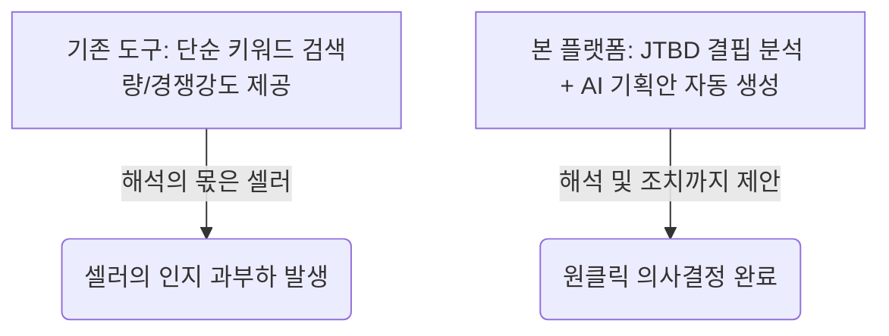

# PRODUCT_VISION.md

# 제품 비전 (Product Vision)

본 문서는 **AI Product Intelligence Platform**의 제품 비전을 정의하고 제품의 핵심 가치, 목표 시장, 포지셔닝을 규정한다.

---

## 1. 비전 선언문 (Vision Statement)

> **"스마트스토어 판매자가 복잡한 분석 도구와 AI 프롬프트를 배우지 않고도, 시장 분석부터 상품 기획 및 판매 성과 환류까지 원스톱으로 처리하는 AI 비서 플랫폼"**

우리의 제품은 데이터 분석과 인공지능 기술의 복잡성을 완전히 추상화하여, 판매자가 오직 '상품의 본질'과 '고객 가치'에만 집중할 수 있는 환경을 제공한다.

---

## 2. 핵심 가치 제안 (Core Value Proposition)

우리가 판매자에게 제공하는 3대 핵심 가치는 다음과 같다.

| 핵심 가치 | 상세 설명 | 판매자 혜택 |
|:---|:---|:---|
| **시간 혁신 (Time Saving)** | 수십 시간이 소요되던 네이버 쇼핑 키워드 분석, 리뷰 분석, 소싱 데이터 수집을 1분 내외로 자동 처리한다. | 상품 소싱 및 마케팅 기획 속도 10배 단축 |
| **데이터 기반 의사결정 (Data-Driven)** | 감에 의존한 상품 소싱을 탈피하고, JTBD(Jobs-To-Be-Done) 프레임워크에 기반한 고객 결핍 분석 및 등급 분류(S~D)를 제공한다. | 상품 기획 실패율 및 재고 리스크 감소 |
| **순환 학습 루프 (Closed-Loop)** | 상품 등록 후 발생한 실제 성과와 피드백 데이터를 AI가 학습하여, 기획안과 프롬프트를 스스로 정교화한다. | 시간이 흐를수록 고도화되는 맞춤형 추천 |

---

## 3. 목표 시장 및 타겟 사용자 (Target Market & Audience)

### 3.1. 주 타겟 시장
* **네이버 스마트스토어 개인 및 소규모 법인 판매자**
* **매출 구간**: 월 100만 원 ~ 5,000만 원 사이의 성장기 셀러
* **특징**: 상품 기획, 마케팅, CS, 물류를 1인 또는 소수 인원이 전담하고 있어 시간적 여유가 절대적으로 부족한 집단.

### 3.2. 타겟의 기술적 성향
* 데이터 분석 도구(아이템스카우트, 판다랭크 등)를 사용해 본 경험은 있으나 데이터 해석에 어려움을 느낌.
* ChatGPT 등의 생성형 AI에 대한 관심은 있으나, 실무에 직접적으로 프롬프트를 작성하여 적용하는 것에는 한계를 느낌.
* 학습 장벽이 낮고 즉시 실행 가능한 결과물을 주는 직관적인 UI/UX를 강력히 선호함.

---

## 4. 경쟁 포지셔닝 (Competitive Positioning)

기존 시장의 도구들과의 명확한 차별성은 다음과 같다.

* **기존 도구 (아이템스카우트 등)**: "이 키워드는 검색량이 10,000건이고 상품수는 5,000개입니다." (사실 전달 중심)
* **본 플랫폼**: "이 키워드군에서 소비자는 '세척의 편리성'에 불만을 가지고 있습니다. 이를 해결하기 위해 '분리형 세척 솔루션'을 소싱하고, 마케팅 키워드는 '원터치 간편 세척'으로 잡으세요." (해결책 및 기획안 중심)
