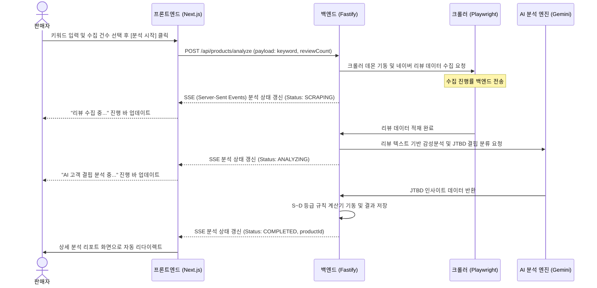
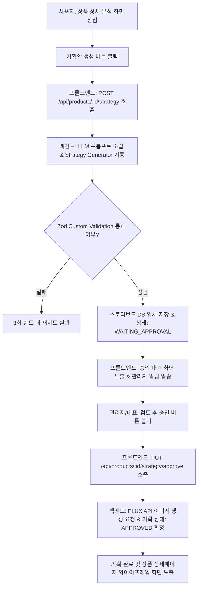
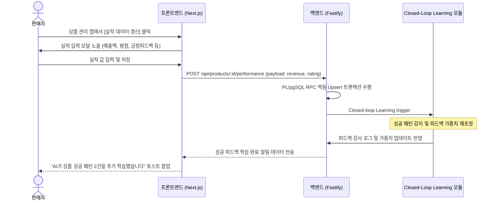
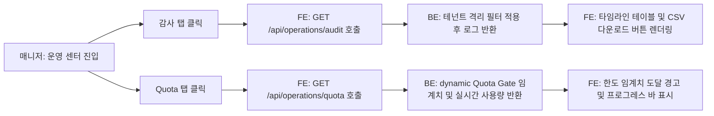

# USER_FLOW.md

# 사용자 흐름도 (User Flow Diagram)

본 문서는 사용자가 플랫폼 내에서 완수하는 핵심 시나리오 4가지에 대한 다이어그램과 절차를 기술한다.

---

## 1. 신규 시장성 및 JTBD 분석 흐름 (Market & JTBD Analysis Flow)

판매자가 특정 네이버 쇼핑 키워드를 대상으로 시장 분석 및 고객 결핍을 추출하는 흐름이다.

---

## 2. AI 상품 기획 스토리보드 생성 및 승인 흐름 (AI Strategy & Approval Flow)

분석된 결핍 데이터를 기반으로 상세페이지 8단계 스토리보드를 생성하고, 관리자의 승인을 얻어 상세 스펙을 확정하는 흐름이다.

---

## 3. 성과 지표 등록 및 Closed-Loop 피드백 학습 흐름 (Closed-Loop Learning Flow)

실제 출시한 상품의 실적 데이터를 입력하여 AI 기획 모델을 자가 개선하는 흐름이다.

---

## 4. 보안 감사 로그 및 Quota 조회 흐름 (Audit & Quota Flow)

매니저가 사용자의 오용을 감사하고, 전체 워크스페이스의 호출 한도를 관리하는 흐름이다.

